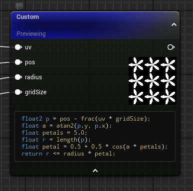
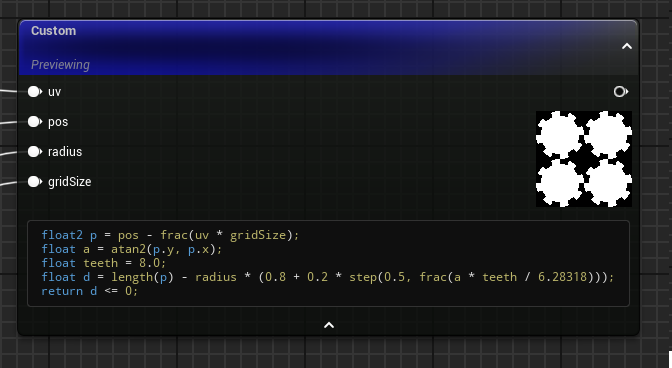
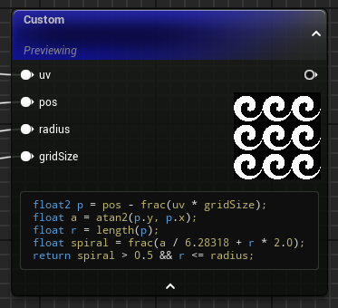

# Unreal-HLSL-Materials
HLSL Shader Studies in Unreal Engine 5

This repository contains a collection of HLSL-based material experiments and tech art studies created in Unreal Engine 5.  
The goal is to explore real-time shader techniques, material authoring, and procedural effects using Unreal’s Custom HLSL nodes.

---

##  Study 2: Simple Shapes

### Preview




## Overview
This study explores generating simple **tileable procedural shapes** using UV manipulation and mathematical functions in HLSL.

The goal was to explre:
- How to repeat patterns using UV tiling
- Building more complex visuals  from simple math

##  Study 2: Animated Mask Material

###  Preview


### Simplified HLSL Logic
```hlsl
// gear
float2 p = pos - frac(uv * gridSize);
float a = atan2(p.y, p.x);
float teeth = 8.0;
float d = length(p) - radius * (0.8 + 0.2 * step(0.5, frac(a * teeth / 6.28318)));
return d <= 0;

// spiral
float2 p = pos - frac(uv * gridSize);
float a = atan2(p.y, p.x);
float r = length(p);
float spiral = frac(a / 6.28318 + r * 2.0);
return spiral > 0.5 && r <= radius;

// flower petals
float2 p = pos - frac(uv * gridSize);
float a = atan2(p.y, p.x);
float petals = 5.0;
float r = length(p);
float petal = 0.5 + 0.5 * cos(a * petals);
return r <= radius * petal;
```

---

##  Overview

This study focuses on a simple animated masking effect driven by UV manipulation and time-based animation.

The goal was to explore:
- Procedural movement using UV space
- Basic masking logic using step functions
- Time-based animation control in HLSL
- How to structure Custom nodes inside Unreal Materials

### Simplified HLSL Logic
```hlsl
return (step((ceil(uv.x * 10) / 10) - (sin(t)), 0.5));
```

---

##  Technical Breakdown

These effects are built using a custom HLSL node inside a Material in Unreal Engine 5.
